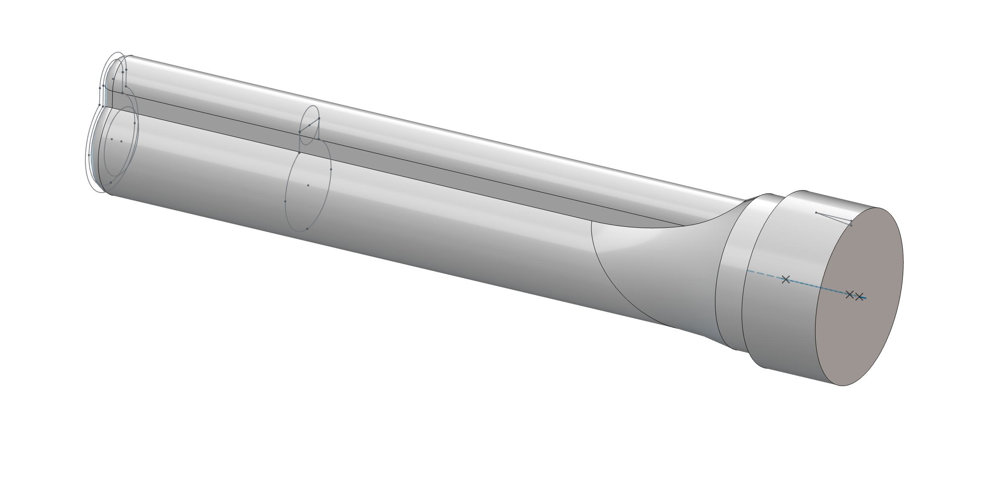
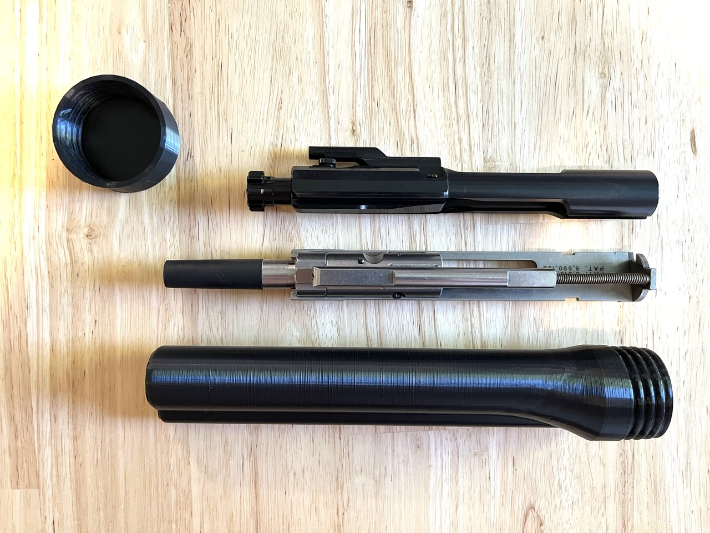
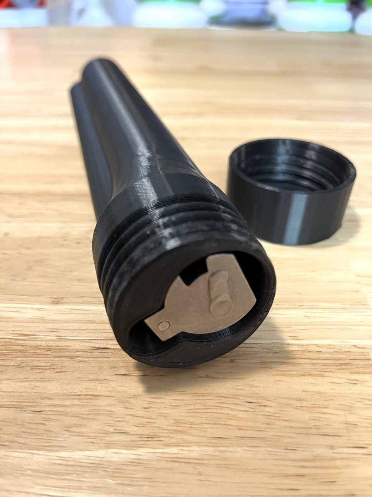
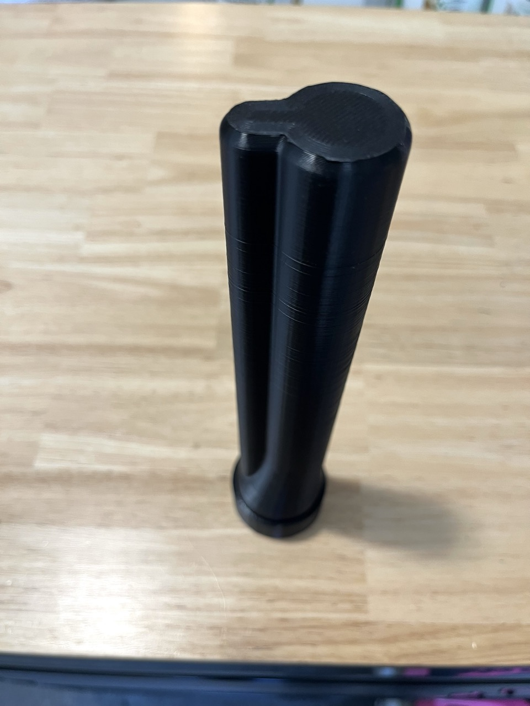
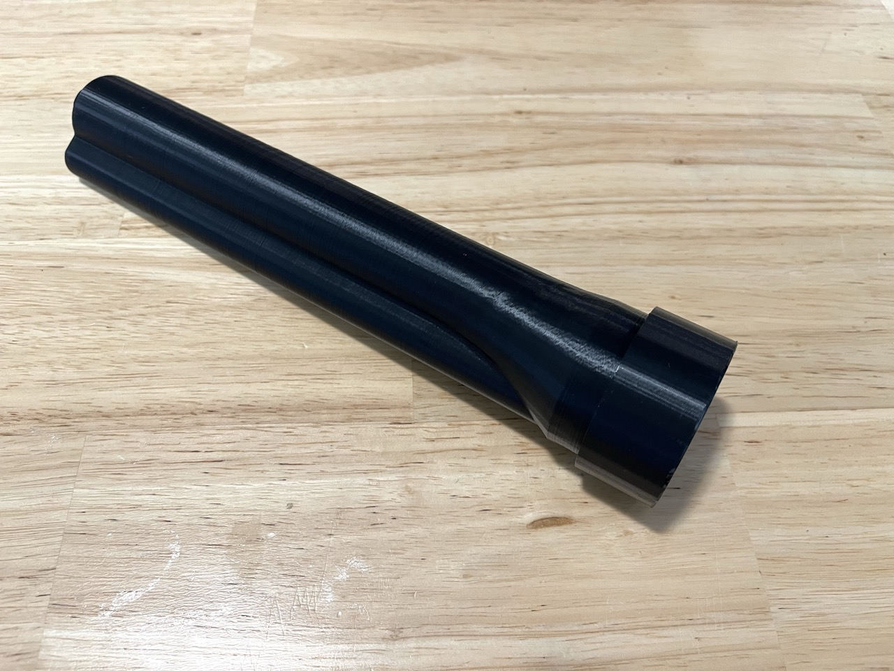
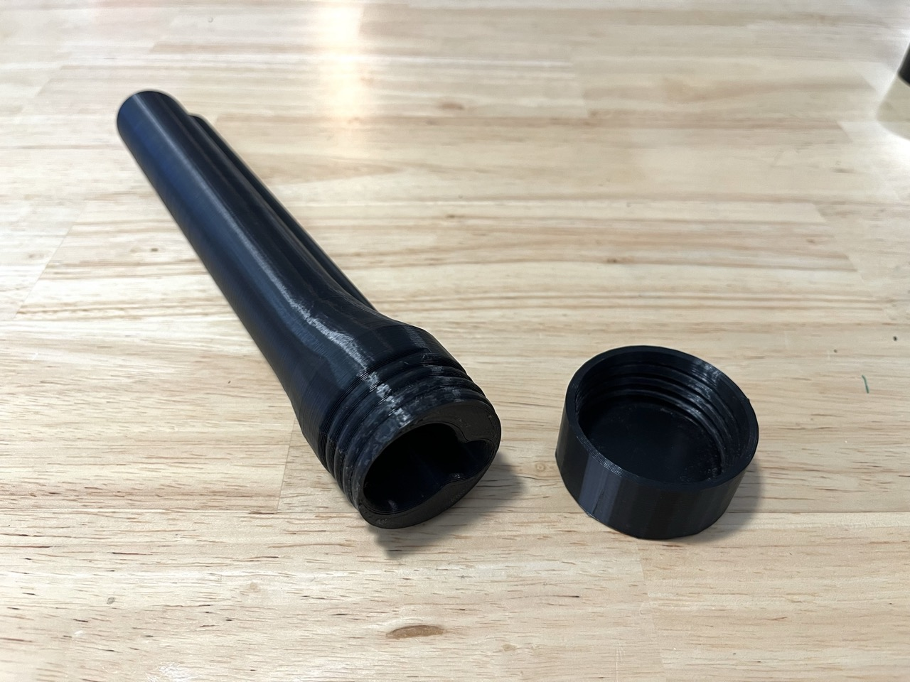

# Carrier Keeper (v1)

## A simple case for storing a standard AR-15/M-16 Bolt Carrier Group or a CMMG-Style conversion bolt (with 556 collar)

## Description

The Carrier Keeper is designed to be an easy-to-print solution for storing a standard AR-15/M-16 bolt carrier group or a CMMG-Style conversion bolt. 

Firearm components often become dirty when used or gooey when cleaned and lubed. The Carrier Keeper provides a simple place to store a full bolt carrier group. It helps keep your range bag clean and your bolt-carrier group protected.

It is designed to be compatible with a standard AR-15/M-16 bolt carrier group, or with a CMMG-style conversion bolt with either a 556 collar or a dedicated 22lr collar.

The design features a simple screw-top interface for securing the keeper to the cap.

It can be printed on most printers (231mm max height) with the filament of your choice. No supports should be necessary, although a brim is highly recommended for some components. See below for details.

## Instructions

### Materials

This is a non-force bearing component. Any filament can be used including standard PLA. You can choose to use any alternative filament of your choice depending upon your material property priorities.

### Print Settings

The following orientations and settings are recommended for printing.

#### Keeper component
- Walls: 4
- Bottom/Top Shells: 6
- Infill: 25%
- Brim: Yes. 12mm 
- Supports: None

Print the Keeper component vertically with the threads oriented at the top of the print. Be sure to use a liberal brim to ensure bed adhesion. 

#### Cap Screw component

- Walls: 4
- Bottom/Top Shells: 6
- Infill: 100%
- Brim: Optional
- Supports: None

Print the Cap Screw vertically with the threads oriented upwards (and visible). You may use a brim, or not, depending on your set-up and its adhesion tendencies.

## Recommendations/Hints

- If you are having bed adhesion problems, try slowing down your printer's XY movement speed and acceleration values. Also, use a brim.

- Take care when putting a hot (or warm) bolt carrier group in your Carrier Keeper. Be aware of the filament materials that were used and their melt-point temperatures.

- If any portion of the Carrier Keeper is damaged, please discard it and print a new one.

- The Carrier Keeper is ONLY designed for storing a bolt carrier group. Do not insert any other items or body parts inside of the product. That being said, the inside edges have been filleted. Use your brain and make good decisions.

## Reference Photos

## License
Copyright © 2025 ZeroMojoro <<zero.mojoro@gmail.com>>

This design, documentation, and additional supporting content is licensed under a custom license ("ZERO License v1 – Remixable Design License with Commercial Physical Use Allowed")

See [license.md](license.md) for full license details

